# Pokémon GO

PokeFanGO Chile es una aplicación que está dirigida a jugadores asiduos a Pokémon Go, entrega información importante, de manera clara y rápida con la finalidad de permitir al jugador avanzar en el juego, detalla información sobre cada pokémon y sus características, además de entregar datos importantes como objetos, pokeradar y datos sobre la comunidad de pokejugadores. 

El usuario puede filtrar los pokemones según los tipos, una vez agrupados los pokemones del mismo tipo, inmediatamente accederá a la información de esos pokémones, por ejemplo, puede conocer sus debilidades o la distancia que debes caminar para la eclosión de sus huevos.

## Historias de usuarios

Una vez identificado el usuario a quién estará dirigida la aplicación, se desarrollaron las historias de usuarios de la siguiente manera:

### Historia de usuario 1:

"Yo como fan de pokémon, quiero ver una página que me facilite la pokedex, para buscar información sobre los caramelos que necesita para evolucionar", para esto el usuario debe hacer las siguientes acciones:

-Usuario ingresa a la aplicación.    
-Usuario presiona botón "pokedex", inmediatamente aparecerán tarjetas con los 151 pokémones.   
-Las tarjetas contarán con datos como tipo y debilidad de cada pokémon, además tendrá la opción de presionar en cada tarjeta para acceder a información más detalla de cada pokémon como cantidad y tipo de dulces que necesita para evolucionar.

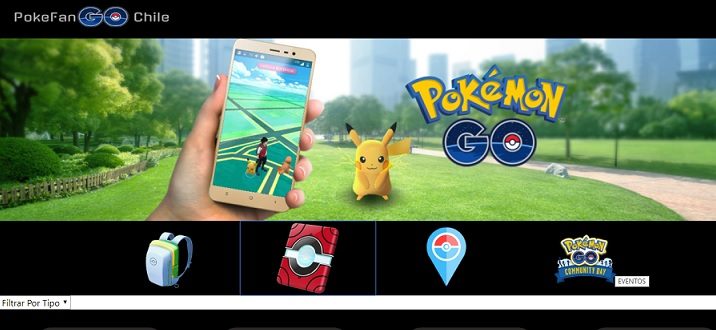

Imagen de inicio de la app.

### Historia de usuario 2:

"Yo como jugador de Pokémon Go, quiero filtrar pokémones de agua, para terminar mi colección de agua"

-Usuario ingresa a la aplicación.  
-Usuario presiona botón "pokedex", inmediatamente aparecerán tarjetas con los 151 pokémones.  
-Luego elige la opción "seleccionar por tipo".  
-Aparecerán las tarjetas de los pokemones del tipo seleccionado, con datos como su tipo y debilidad, además tendrá la opción de presionar en cada tarjeta para acceder a información más detalla de cada pokémon.

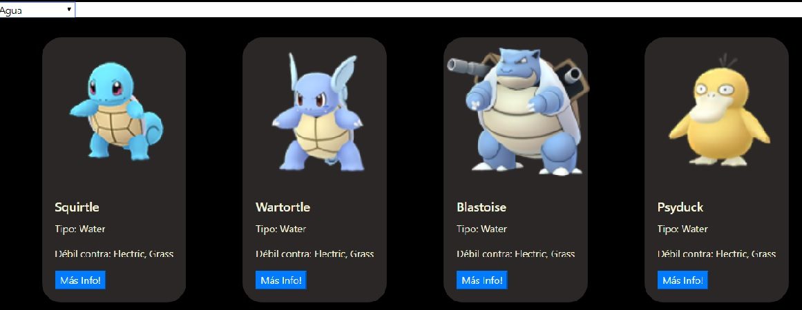

Imagen de pokemones filtrados por tipo agua.

## Proceso de creación

Se partió creando una planificación detallada en Trello, como muestra en el siguiente link:  https://trello.com/b/UgVXjdGx/poketablero 

Se diseñó un sketch (prototipo de baja fidelidad), para visualizar como deberíaa quedar la aplicación. Se optó por un diseño simple y fácil de entender para el usuario. Este prototipo se testeó en usuarios y se agregaron mejoras de acuerdo a sus recomendaciones.

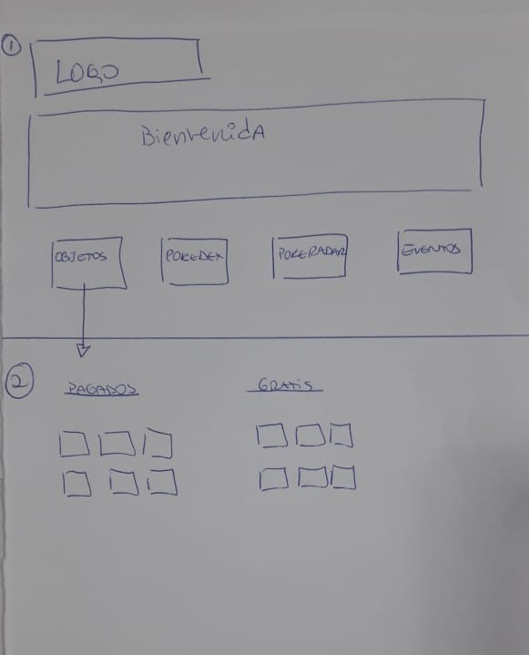
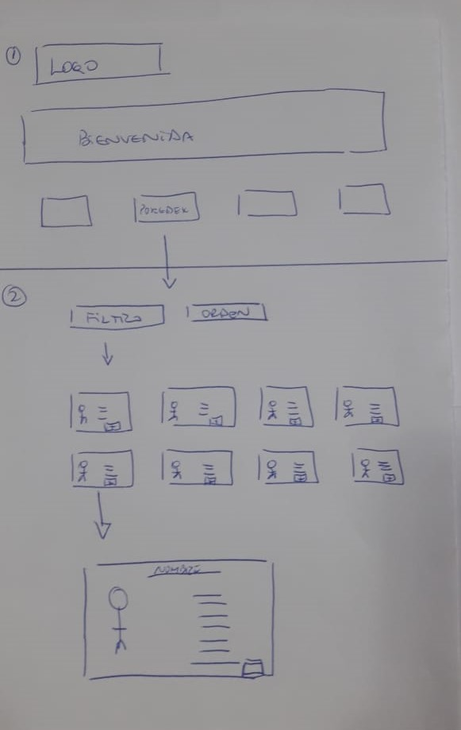
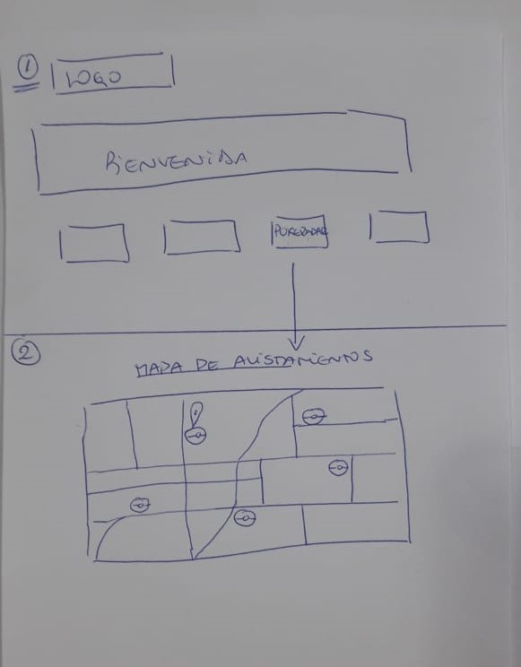
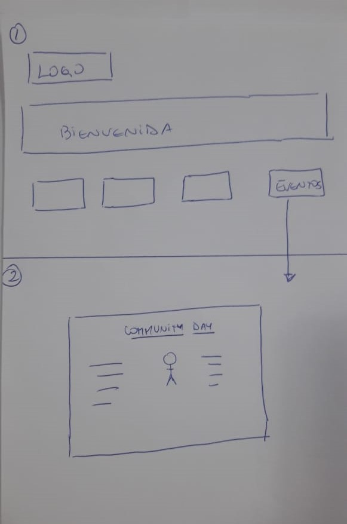

Imágenes de como se ideó el prototipo de la app.

Luego se hizo un diseño en figma (prototipo de alta fidelidad), el cual fue testeado en usuarios para entregar resultado final.

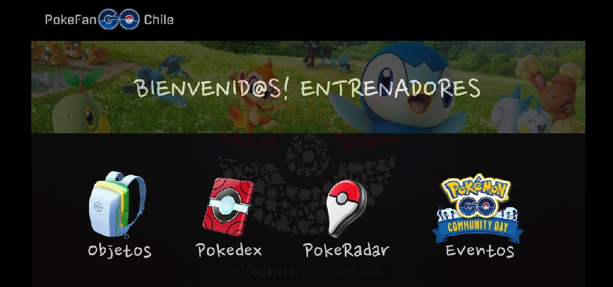
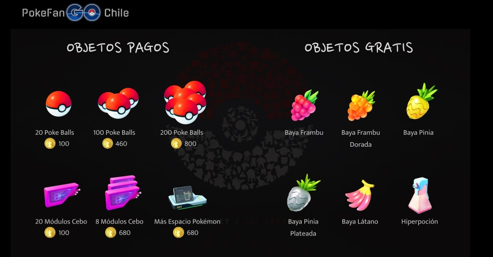
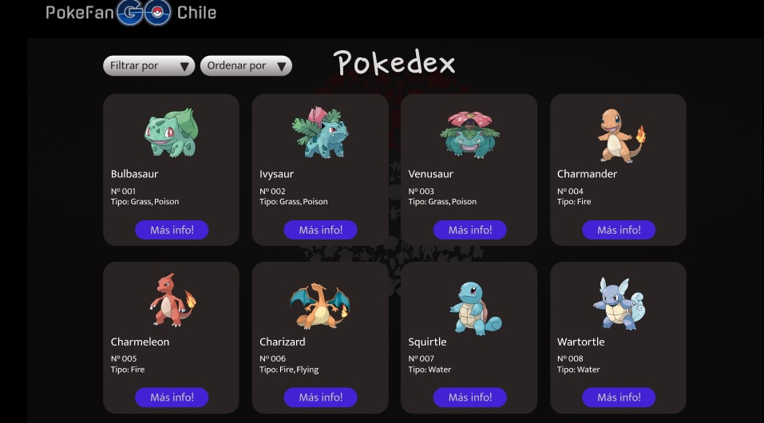
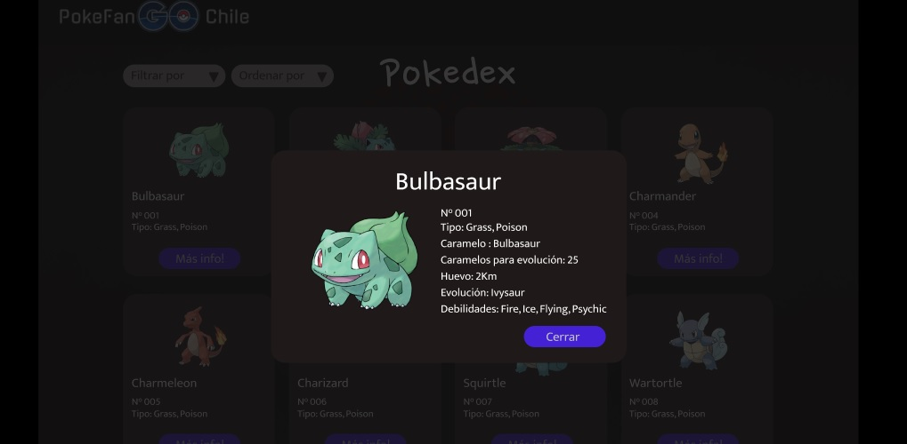
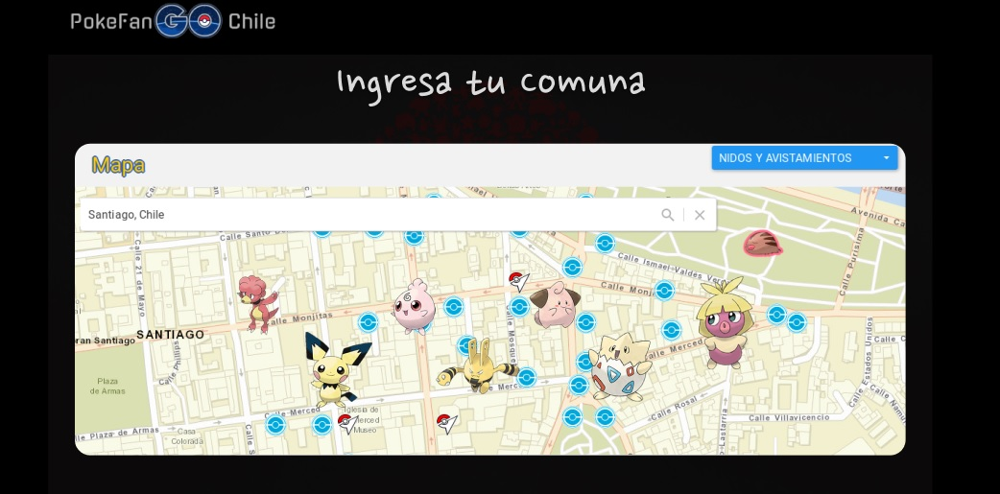
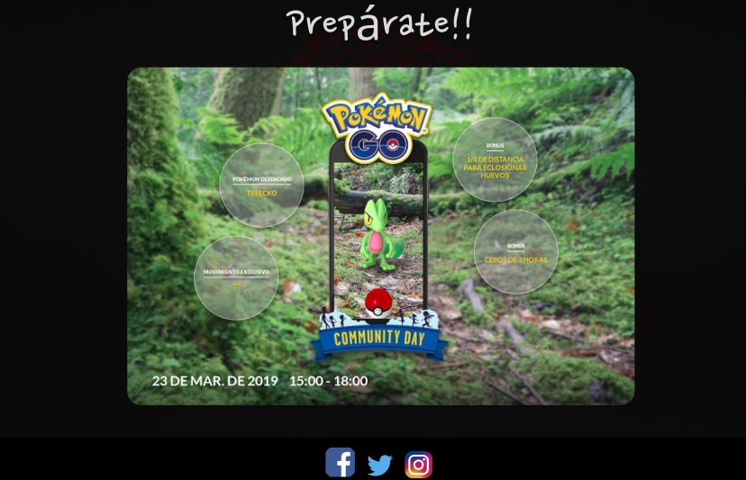
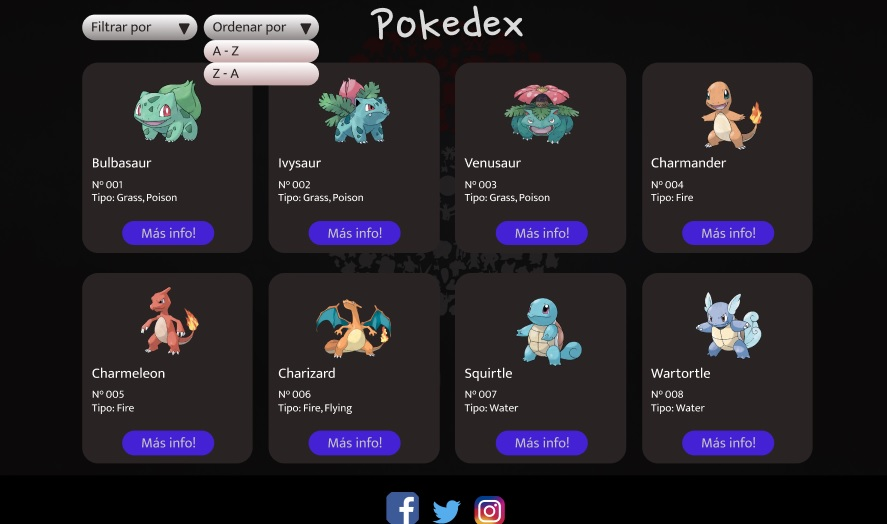

Imágenes del prototipo de alta fidelidad.

### Testeos de usuario:

Además se hicieron testeo de usuarios de la app, las que quedaron registradas en vídeo. En estos test se detectaron los siguientes problemas:

-Confuso uso de los botones  
-Problemas con el formato responsive   
-Falta de información sobre los pokemones  
-Demora en cargar la data  
-Botón de filtrado muy pequeño  
-Color de fondo blanco hacía perder enfoque en imágenes

Links de los vídeos que se hicieron con los usuarios:

https://www.youtube.com/watch?v=_5KktOjd40U
https://www.youtube.com/watch?v=QR5VZDRw7YM
https://www.youtube.com/watch?v=-9pT0mBbZUo
https://www.youtube.com/watch?v=WQ2PEzz59nw
https://www.youtube.com/watch?v=BdI58PBvuD4&t=3s